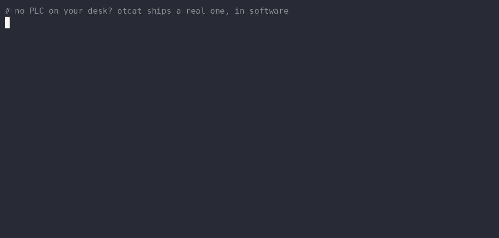

<p align="center">
  <picture>
    <source media="(prefers-color-scheme: dark)" srcset="assets/otcat-dark.png">
    <source media="(prefers-color-scheme: light)" srcset="assets/otcat-light.png">
    
  </picture>
</p>

<h1 align="center">otcat — the netcat for industrial I/O</h1>

<p align="center">
  <strong>Read, write, and watch PLC registers directly from your shell, the way <code>nc</code> inspects a TCP socket.</strong>
</p>

<p align="center">
  <a href="https://quitoperation.github.io/otcat/"></a>
  <a href="https://go.dev/"></a>
  <a href="https://pypi.org/project/otcat/"></a>
  <a href="LICENSE"></a>
  <a href="https://goreportcard.com/report/github.com/QuitOperation/otcat"></a>
  <a href="https://github.com/QuitOperation/otcat/stargazers"></a>
</p>

<p align="center">
  <a href="https://quitoperation.github.io/otcat/">🌐 <strong>Live Website</strong></a> •
  <a href="#install--build">📦 <strong>Packages & Install</strong></a> •
  <a href="#python-bindings">🐍 <strong>Python Library</strong></a> •
  <a href="docs/driver_roadmap.md">🗺️ <strong>Driver Roadmap</strong></a> •
  <a href="CONTRIBUTING.md">🤝 <strong>Contributing</strong></a>
</p>

---

## ⚡ Quick Start

```sh
# 1. Read holding register 40001 and output as structured JSON
otcat --modbus 192.168.1.10:502 --read holding:40001 --json

# 2. Use the short binary alias 'otc' to watch telemetry every 500ms
otc --modbus 192.168.1.10:502 --watch holding:40001 --interval 500ms --raw | awk '{print $1*0.1}'

# 3. Write a setpoint with explicit safety confirmation gate
otcat --modbus 192.168.1.10:502 --write holding:40001 --value 100 --confirm

# 4. Stream setpoint values straight from stdin into a PLC register
cat setpoints.txt | otcat --modbus 192.168.1.10:502 --write holding:40001 --from-stdin --confirm
```

<p align="center">
  
</p>

---

## 📋 Table of Contents

- [Why otcat?](#-why-otcat)
- [Architecture & Data Flow](#-architecture--data-flow)
- [Protocol Support Matrix](#-protocol-support-matrix)
- [Install & Build](#-install--build)
- [Address Specification](#-address-specification)
- [Write Safety Gate](#-write-safety-gate)
- [Output Formats](#-output-formats)
- [Exit Codes](#-exit-codes)
- [Python Bindings](#-python-bindings)
- [Testing & Benchmarks](#-testing--benchmarks)
- [Project Layout](#-project-layout)
- [License](#-license)

---

##💡 Why otcat?

70% of field OT troubleshooting is simply verifying register readings. Traditional vendor SCADA software requires gigabytes of proprietary installation, complex licensing, and Windows GUIs.

`otcat` brings standard Unix pipe philosophy to industrial automation:
- **Zero Dependencies**: Single static Go binary. No CGO, no external libraries.
- **Short Alias Included**: Ships with `otc` binary alias (`nc` : `netcat` :: `otc` : `otcat`).
- **Fail-Safe Write Gates**: Built-in interactive confirmation & `--confirm` flags prevent unintended physical register mutations.
- **Composable**: Outputs newline-delimited JSON, CSV, or raw numbers ready for `jq`, `awk`, or `grep`.

---

## 🏗️ Architecture & Data Flow

```
  +-------------------------------------------------------------------------+
  |                          OPERATOR / SHELL / CI                          |
  |     otcat --modbus 192.168.1.10:502 --read holding:40001 --json | awk |
  +-------------------------------------+-----------------------------------+
                                        |
                                        v
  +-------------------------------------------------------------------------+
  |                          OTCAT ENGINE (v1.0.0)                          |
  |  +--------------------+   +-------------------+   +------------------+  |
  |  |  Codec (JSON/CSV)  |   |   Safety Gate     |   |   Watch Loop     |  |
  |  +---------+----------+   +---------+---------+   +--------+---------+  |
  +------------|------------------------|----------------------|------------+
               |                        |                      |
               +------------------------v----------------------+
                                        |
                            [ Driver Abstraction ]
                                        |
               +------------------------+-----------------------+
               |                        |                       |
               v                        v                       v
     +-------------------+    +--------------------+  +--------------------+
     | Modbus TCP Driver |    | EtherNet/IP (stub) |  | S7comm/BACnet (sub)|
     +---------+---------+    +--------------------+  +--------------------+
               |
               v (TCP Port 502)
  +-------------------------------------------------------------------------+
  |                    FIELD PLC / CONTROLLER / GATEWAY                     |
  +-------------------------------------------------------------------------+
```

---

## 📊 Protocol Support Matrix

| Protocol | Driver Flag | Status | Supported Function Codes & Data Tables |
| :--- | :---: | :---: | :--- |
| **Modbus TCP** | `--modbus` | **Complete (100%)** | Coils (FC01/05/15), Discrete (FC02), Holding (FC03/06/16), Input (FC04) |
| **EtherNet/IP** | `--eip` | *Roadmap* | Registered CLI stub. See [`docs/driver_roadmap.md`](docs/driver_roadmap.md) |
| **S7comm** | `--s7comm` | *Roadmap* | Registered CLI stub. See [`docs/driver_roadmap.md`](docs/driver_roadmap.md) |
| **BACnet/IP** | `--bacnet` | *Roadmap* | Registered CLI stub. See [`docs/driver_roadmap.md`](docs/driver_roadmap.md) |

---

## 📦 Install & Build

### Package Managers
Install native packages via APT, DNF, APK, pip, or Go toolchain:

```sh
# Debian / Ubuntu (APT)
sudo apt install -y otcat

# Fedora / RHEL (DNF)
sudo dnf install -y --nogpgcheck otcat

# Alpine Linux (APK)
apk add --allow-untrusted otcat

# Python PyPI (pip)
pip install otcat

# Go Toolchain (Go 1.22+)
go install github.com/QuitOperation/otcat/cmd/otc@latest
```

### Build from Source
```sh
git clone https://github.com/QuitOperation/otcat.git
cd otcat

# Build main binaries
go build -o otcat ./cmd/otcat
go build -o otc ./cmd/otc

# Build simulation & diagnostic tools
go build -o otcat-mockplc ./cmd/otcat-mockplc
go build -o otcat-latencyprobe ./cmd/otcat-latencyprobe
```

---

## 🎯 Address Specification

Addresses follow the standard format: `table:address[:count]`

```
holding:40001       # Holding Register 40001 (0-indexed wire offset 0x0000)
input:30005         # Input Register 30005
coil:00001          # Coil 1
discrete:10010      # Discrete Input 10010
```

With `--raw-address`, addresses are interpreted directly as literal zero-based protocol wire offsets (`holding:0`). See [`docs/classic_addressing.md`](docs/classic_addressing.md) for detailed resolution logic.

---

## 🛡️ Write Safety Gate

To protect physical machinery and operational technology networks, **all write operations are safely gated**:

```sh
# Interactive confirmation prompt on stderr:
$ otcat --modbus 192.168.1.10:502 --write holding:40001 --value 100
CONFIRM WRITE: Write 100 to holding:40001 on 192.168.1.10:502? [y/N] y
SUCCESS: Register 40001 updated to 100.

# Non-interactive automated scripts require --confirm:
otcat --modbus 192.168.1.10:502 --write holding:40001 --value 100 --confirm
```

<p align="center">
  
</p>

---

## 📄 Output Formats

| Flag | Format Description | Typical Use Case |
| :--- | :--- | :--- |
| `--json` | Newline-delimited JSON objects | Piping into `jq`, web APIs, logging pipelines |
| `--csv` | Header row + CSV data rows | Spreadsheet export & historical auditing |
| `--raw` | Bare numeric scalar values | Shell arithmetic, `awk`, `bc`, `tee` |

<p align="center">
  
</p>

---

## 🚦 Exit Codes

| Code | Meaning | Cause |
| :---: | :--- | :--- |
| **`0`** | **Success** | Query or write completed cleanly |
| **`1`** | **Usage Error** | Invalid flags, malformed register address spec |
| **`2`** | **Connection Error** | Timeout, network unreachable, dial refused |
| **`3`** | **Protocol Error** | PLC returned a Modbus exception PDU |
| **`4`** | **Write Aborted** | Safety confirmation declined |
| **`5`** | **I/O Error** | Broken output pipe |
| **`130`** | **Interrupted** | `--watch` stream terminated by SIGINT / SIGTERM |

---

## 🐍 Python Bindings

`otcat` ships an official Python package wrapping the compiled Go core binary with zero extra dependencies:

```python
from otcat import Client

# Connect to target PLC
c = Client("192.168.1.10:502")

# Single read query
val = c.read("holding:40001")
print(val.value, val.quality, val.ts)

# Stream continuous telemetry
for item in c.watch("holding:40001", interval="500ms", count=10):
    print(item.ts, item.value)
```

```sh
pip install otcat          # Core client
pip install otcat[pandas]  # + DataFrame helpers
pip install otcat[fastapi] # + Async WebSockets client
```

For full Python documentation, see [`python/README.md`](python/README.md).

---

## 🧪 Testing & Benchmarks

```sh
# Run full unit & integration test suite
go test ./...

# Race detector + code coverage
go test ./... -race -cover

# Run latency benchmarks
go test ./... -bench=. -benchmem

# Coverage-guided fuzzing
go test ./internal/modbus/ -fuzz=FuzzDecodeMBAP -fuzztime=60s
```

---

## 📁 Project Layout

```
.
├── cmd/
│   ├── otcat/              # Primary CLI binary
│   ├── otc/                # Short binary alias
│   ├── otcat-mockplc/       # Standalone Modbus TCP mock server
│   └── otcat-latencyprobe/ # Latency measurement tool
├── internal/
│   ├── modbus/             # Modbus TCP driver implementation
│   ├── codec/              # JSON, CSV, and Raw formatters
│   ├── watch/              # Watch loop & exponential backoff
│   └── cliapp/             # CLI flags & safety confirmation gates
├── docs/                   # Technical design decision write-ups
├── python/                 # Python package bindings
├── demo/                   # Terminal GIF recordings & VHS tapes
└── assets/                 # Brand assets & logos
```

---

## 📄 License

Distributed under the **MIT License**. See [`LICENSE`](LICENSE) for details.

<p align="center">
  <sub>Created by <strong>QuitOperation</strong> — Industrial I/O without vendor software bloat.</sub>
</p>
